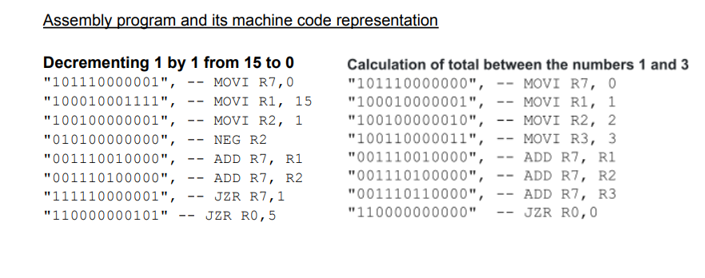

#### Assigned Task:

In this lab, a 4-bit nano processor which is capable of executing the instructions will be designed. To build this circuit, we need to develop the following components.

    ● 4-bit Add/Subtract unit
    ● 3-bit adder
    ● 3-bit Program Counter (PC)
    ● K-way b-bit multiplexers
    ● Register Bank
    ● Program ROM
    ● Buses
    ● Instruction Decoder
    ● 7-segment display

After designing these components, the functionality should be checked by programming the Basys 3 board. Functionality of the processor will be checked with different instruction sets in the ROM.

We have designed a simple microprocessor capable of executing a set of instructions. In this scenario, we have given a set of instructions as mentioned earlier, to the program ROM to countdown from 15 to 0 as hexadecimal values as well as to calculate the sum of numbers between 1 and 3. Instruction Decoder is responsible to activate the necessary components based on the instructions that are going to be executed and the register bank stores the values temporarily while multiplexers are selecting a specific value from a set of values. So, in this way, a 4-bit nano processor can be implemented as a combination of different components which have been already designed in previous labs.

*Refer the lab sheet Lab 9-10 Microprocessor for further details.*
